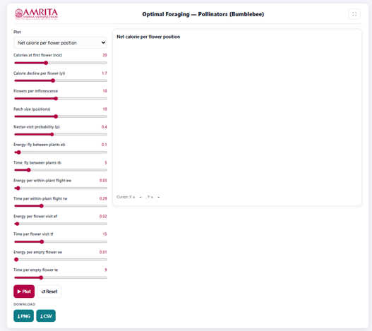
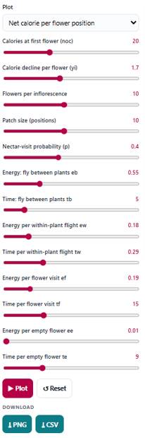
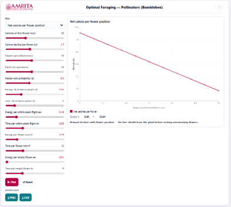

### Procedure

1. The simulator enables users to investigate the foraging behaviour of bumblebees under different ecological conditions by evaluating the energetic costs and benefits associated with nectar collection. Users can configure floral resource availability, nectar rewards, travel costs, and foraging parameters, execute the simulation, and analyze the optimal foraging strategy using graphical outputs.

 
&nbsp;

2. The simulator consists of a parameter panel on the left and a graphical visualization panel on the right.

 
&nbsp;

3. Select the desired graph from the Plot drop-down menu. The simulator provides different graphical analyses to evaluate various aspects of pollinator foraging behaviour. Select the required graph for analysis.
 
&nbsp;

4. Specify the calories available at the first flower (noc) using the corresponding slider. This parameter defines the initial nectar reward available when the pollinator visits the first flower within an inflorescence.
 
&nbsp;

5. Adjust the calorie decline per flower (γᵢ) using the corresponding slider. This parameter determines the reduction in nectar reward with successive flower visits within the same inflorescence.
 
&nbsp;

6. Specify the number of flowers per inflorescence using the Flowers per inflorescence slider. This parameter defines the number of flowers available for foraging on an individual plant.
 
&nbsp;

7. Set the patch size (positions) using the corresponding slider. This parameter specifies the number of flowering plants or foraging locations available within the habitat patch.
 
&nbsp;

8. Adjust the nectar-visit probability (p) using the corresponding slider. This parameter determines the probability that an individual flower contains nectar when visited by the pollinator.
 
&nbsp;

9. Specify the energy required for flight between plants (eb) using the corresponding slider. This parameter represents the energetic cost incurred while moving between different flowering plants.
 
&nbsp;

10.	Specify the time required for flight between plants (tb) using the corresponding slider. This parameter defines the travel time between successive plants during foraging.
 
&nbsp;

11.	Adjust the energy required for within-plant flight (ew) using the corresponding slider. This parameter represents the energetic cost of movement between flowers on the same plant.
 
&nbsp;

12.	Specify the time required for within-plant flight (tw) using the corresponding slider. This parameter determines the travel time between flowers within a single plant.
 
&nbsp;

13.	Adjust the energy required for visiting a flower (ef) using the corresponding slider. This parameter represents the energetic expenditure associated with handling and extracting nectar from a flower.
 
&nbsp;

14.	Specify the time required for flower visitation (tf) using the corresponding slider. This parameter defines the duration of nectar collection at each flower.
 
&nbsp;

15. Adjust the energy required to inspect an empty flower (ee) using the corresponding slider. This parameter represents the energetic cost incurred when visiting a flower that contains no nectar.
 
&nbsp;

16. Specify the time required to inspect an empty flower (te) using the corresponding slider. This parameter determines the time spent examining flowers that do not contain nectar.
 
&nbsp;

17. After configuring all simulation parameters, click the Plot button to generate the selected graphical output.

 
&nbsp;

18. Observe the graph displayed in the visualization panel. The graph illustrates the net calorie gain obtained by the bumblebee at successive flower positions within an inflorescence. Interpret the X-axis (Flower position on inflorescence) to identify the sequence of flower visits made by the pollinator.
 
&nbsp;

19. Interpret the Y-axis (Net Calories) to examine the net energetic gain obtained from each flower after accounting for the energetic costs associated with foraging.
 
&nbsp;

20. Observe the trend of the curve to determine how the energetic reward changes as the bumblebee visits successive flowers. Compare the net calorie gain at the initial flower positions with that obtained from later flower positions.
 
&nbsp;

21. Identify the point at which the net calorie gain becomes substantially reduced. This indicates that the energetic benefits of visiting additional flowers decline due to decreasing nectar availability and the energetic costs associated with continued foraging.
 
&nbsp;

22. Read the interpretation message displayed below the graph. This message summarizes the simulation results and provides guidance on the optimal point at which the pollinator should leave the current plant and search for another flowering plant.
 
&nbsp;

23. Move the cursor over the graph, if required, to display the corresponding coordinate values shown beneath the graph. These values indicate the net calorie gain associated with a particular flower position.
 
&nbsp;

24. Modify one or more simulation parameters, such as the initial nectar reward, nectar depletion rate, number of flowers per inflorescence, nectar availability, or energetic costs, and generate the graph again to examine how these factors influence the energetic returns from foraging.
 
&nbsp;

25. If required, click the Reset button to restore the default simulation parameters before performing another simulation.
 
&nbsp;

26. Download the graphical output by clicking the PNG button or export the numerical simulation data by clicking the CSV button for further analysis and comparison.
 
&nbsp;

27. Repeat the above procedure using different parameter combinations to compare changes in net calorie gain under varying ecological conditions and identify the conditions that maximize the energetic efficiency of bumblebee foraging.

 
&nbsp;

