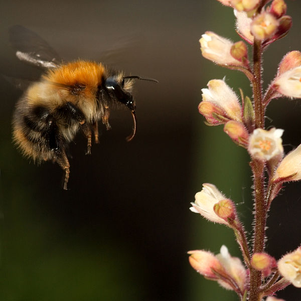
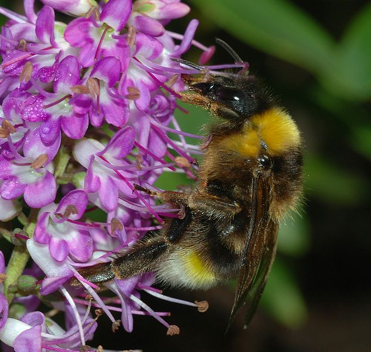
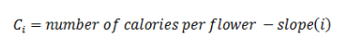
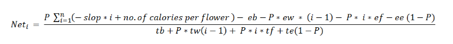

&nbsp;

All organisms will forage in such a way that their fitness is maximized, and therefore this approach has widely known as optimal foraging theory. Foraging ecology encompasses all the behaviors that go with obtaining resources. The resources include living and nonliving things like prey, shelter etc. For example, flowers even “forage” for pollinators.

While considering a bee colony, usually it consists of a queen and workers with different tasks. A forager is a worker with a single task of collecting nectar and pollen. The efficiency of the worker and the quantity of this food determines the reproductive success of the colony. That is, the collected nectar is brought back to the colony and it is stored as the energy source for the colony. All the metabolic process includes growth, survival, and the reproductive output of the colony is dependent of this stored nectar. Therefore natural selection should have favored those bumblebees which maximize their net rate of energy gain while foraging for nectar. 

&nbsp;

#### A Case of Bumblebee Foraging on a Lupine:

Lupine is a plant with long spikes of pea-like flowers. Let us consider a scenario of bumblebee foraging on a lupine.

Image source: http://en.wikipedia.org

 
&nbsp;

The lowest flower on the spike matures first and contains the most nectar. As the season progresses, this flower disintegrate and the next flower up becomes the lowest flower. And so the process continues throughout the flowering season. On any one day during the season, there is a linear relationship between floral position and caloric content of the flower. For a lupine, this relationship can be described as

 Where, **i** refers to the position of the flower (the bottom-most flower is number 1) .

&nbsp;

A bumblebee tends to feed first from the bottom flower, which contains the most calories, and works its way up the stalk. It leaves the plant, however, before it has fed on all the flowers.

&nbsp;

Suppose we have  collected some information about the energetics of this species of bee on a particular day in a certain region.
Mathematically we can model this energetics based on the collected information. Therefore we can study the movement of bee from one plant to another to collect the nectar and thus we can analyze whether its foraging behaviour is in an optimal manner or not.

The mathematical model to calculate the net energy is given as,

Where,

**Net i** is the total energy gained by visit to i flowers.

**P** is the  Probability that the plant has not been drained of nectar delay,

 

**eb** is the Energy expended in flying from one plant to another,

 

**tb** is the  Time spent in flying from one plant to another,

 

**ew** is the  Energy spent in flying one flower to another on same stalk,

 

**tw** is the  Time spent in flying one flower to another on same stalk,

 

**ef** is the  Energy spent in emptying a full flower,

 

**tf** is the  Time spent in emptying a full flower,

 

**ee** is the  Energy spent in sampling an "empty" flower,

 

**te** is the Time spent in sampling an "empty" flower,

 

**n** is  the Last flower position visited by a bee.

 

The denominator of the above equation describes the time spent for foraging on that plant and moving to the next plant. When the ratio is maximized, we can say that the bee is foraging optimally.